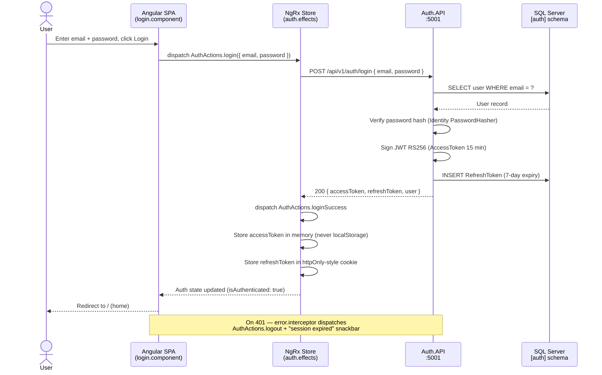
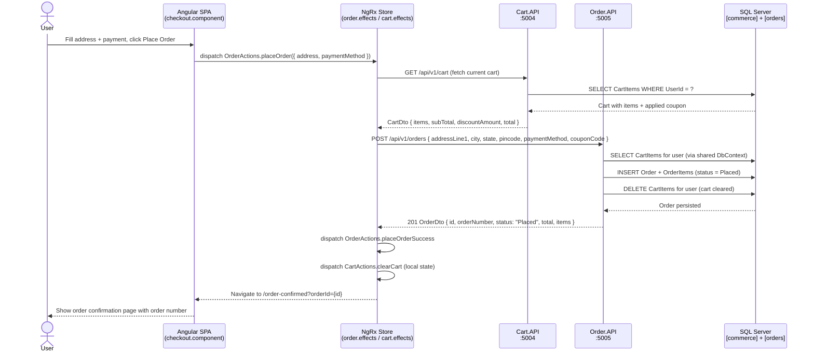

# ARCHITECTURE.md — Tata CLiQ E-Commerce Clone

## Solution Overview

```
tatacliq-clone/
├── CLAUDE.md                    ← Project rules. Read every session.
├── TODO.md                      ← Phase-level task checklist
├── .env.example                 ← Required environment variables
├── docker-compose.yml           ← Full local dev stack
├── docs/
│   ├── DESIGN.md                ← Design system (colours, typography, breakpoints)
│   ├── ARCHITECTURE.md          ← This file
│   └── skills/
│       ├── angular.md           ← Angular patterns (Phase 3)
│       └── dotnet.md            ← .NET patterns (Phase 2)
├── backend/
│   ├── tatacliq-clone.sln
│   └── src/
│       ├── Services/
│       │   ├── TataCliq.Auth.API/       ← JWT, Identity, OTP
│       │   ├── TataCliq.User.API/       ← Profile, addresses, wishlist
│       │   ├── TataCliq.Catalog.API/    ← Products, categories, brands
│       │   ├── TataCliq.Cart.API/       ← Cart, coupons
│       │   ├── TataCliq.Order.API/      ← Order lifecycle, tracking
│       │   ├── TataCliq.Payment.API/    ← Razorpay (Phase 5)
│       │   ├── TataCliq.Notification.API/
│       │   ├── TataCliq.Seller.API/
│       │   └── TataCliq.Admin.API/      ← CMS, banners, coupons
│       └── Shared/
│           ├── TataCliq.SharedKernel/   ← BaseEntity, Result<T>, IRepository<T>
│           └── TataCliq.Infrastructure/ ← EF Core DbContext, EfRepository<T>
└── frontend/                    ← Angular 21 SPA
    └── src/app/
        ├── core/                ← Guards, interceptors, services, config
        ├── shared/              ← Reusable components, pipes, directives
        ├── features/            ← Lazy-loaded pages (home, catalog, cart, checkout…)
        │   ├── home/
        │   ├── catalog/
        │   ├── cart/
        │   ├── checkout/
        │   ├── orders/
        │   ├── account/
        │   └── admin/
        ├── layout/              ← Header, footer, mega-menu, bottom-nav
        └── store/               ← NgRx: actions, reducers, selectors, effects
            ├── auth/
            ├── cart/
            ├── catalog/
            └── ui/
```

---

## Backend Architecture: Clean Architecture per Service

Each .NET microservice follows the same internal structure:

```
TataCliq.<Name>.API/
├── Controllers/         ← HTTP entry points; delegate to Services
├── Services/            ← Business logic; call Repositories
├── Repositories/        ← Data access via EF Core (implements IRepository<T>)
├── DTOs/                ← Request + Response DTOs
├── Validators/          ← FluentValidation validators for request DTOs
├── Mapping/             ← AutoMapper profiles (Entity ↔ DTO)
├── Middleware/          ← Service-specific middleware (if any)
├── Program.cs           ← Minimal API bootstrap, DI registrations
├── appsettings.json
├── appsettings.Development.json
└── Dockerfile
```

---

## Frontend Architecture: Feature Modules

Angular 21 uses standalone components (no NgModules). All pages are lazy-loaded.

### Routing Structure

```
/                        → features/home (lazy)
/search                  → features/catalog/plp (lazy) [?category&brand&price&sort&page]
/product/:id             → features/catalog/pdp (lazy)
/cart                    → features/cart (lazy)
/checkout                → features/checkout (lazy) [auth guard]
/orders                  → features/orders/list (lazy) [auth guard]
/orders/:id              → features/orders/detail (lazy) [auth guard]
/account                 → features/account (lazy) [auth guard]
/admin                   → features/admin (lazy) [admin role guard]
/login                   → features/auth/login (lazy)
/register                → features/auth/register (lazy)
```

### NgRx State Shape

```ts
AppState {
  auth: {
    user: User | null,
    accessToken: string | null,   // memory only — NEVER localStorage
    isLoading: boolean,
    error: string | null
  },
  cart: {
    items: CartItem[],
    coupon: Coupon | null,
    isLoading: boolean
  },
  catalog: {
    products: Product[],
    totalCount: number,
    filters: FilterState,
    sortBy: SortOption,
    isLoading: boolean
  },
  ui: {
    isGlobalLoading: boolean,
    snackbar: SnackbarState | null
  }
}
```

---

## Database Schemas (SQL Server — EF Core)

| Schema       | Tables |
|-------------|--------|
| `[auth]`    | Users, Roles, UserRoles, RefreshTokens, Addresses |
| `[catalog]` | Categories, Brands, Products, ProductVariants, ProductImages |
| `[commerce]`| Carts, CartItems, Wishlists, WishlistItems |
| `[orders]`  | Orders, OrderItems, OrderStatusHistory |
| `[payments]`| Payments, Refunds |
| `[admin]`   | Banners, Coupons, AuditLogs |

---

## API Port Map (Local Dev)

| Service          | Port  | Swagger URL                    |
|------------------|-------|-------------------------------|
| Auth.API         | 5001  | http://localhost:5001/swagger  |
| User.API         | 5002  | http://localhost:5002/swagger  |
| Catalog.API      | 5003  | http://localhost:5003/swagger  |
| Cart.API         | 5004  | http://localhost:5004/swagger  |
| Order.API        | 5005  | http://localhost:5005/swagger  |
| Admin.API        | 5009  | http://localhost:5009/swagger  |
| Angular SPA      | 4200  | http://localhost:4200          |
| SQL Server       | 1433  | —                              |

---

## Sequence Diagrams

### Login Flow



---

### Place Order Flow



---

## Naming Conventions

### C# / .NET
- Classes: `PascalCase`
- Interfaces: `IPascalCase`
- Methods: `PascalCase`
- Private fields: `_camelCase`
- DTOs: `<Resource>RequestDto`, `<Resource>ResponseDto`
- Controllers: `<Resource>Controller`

### Angular / TypeScript
- Components: `kebab-case.component.ts` → class `KebabCaseComponent`
- Services: `kebab-case.service.ts` → class `KebabCaseService`
- NgRx actions: `[Feature] Action Name` string, camelCase creator name
- Interfaces/Models: `PascalCase` (e.g. `Product`, `CartItem`)
- No `any` — use typed models or `unknown`

### Database
- Tables: `PascalCase` singular (e.g. `Product`, `OrderItem`)
- Columns: `PascalCase`
- Indexes: `IX_<Table>_<Column>`
- Foreign keys: `FK_<ChildTable>_<ParentTable>_<Column>`
